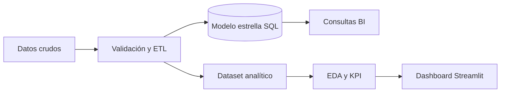

# Insight Sales Lab

Proyecto de análisis de datos y Business Intelligence construido sobre un caso simulado de una cadena minorista mexicana. Convierte datos de ventas deliberadamente imperfectos en un modelo analítico reproducible, indicadores ejecutivos y un dashboard interactivo.

> **English summary:** End-to-end retail analytics portfolio project covering synthetic data generation, data quality, ETL, dimensional SQL modeling, exploratory analysis, KPI design, automated tests and a Streamlit dashboard.

## Problema de negocio

La dirección comercial necesita responder cinco preguntas:

1. ¿Cómo evolucionan ingresos, utilidad y margen?
2. ¿Qué regiones, canales y categorías explican los resultados?
3. ¿Dónde se concentran devoluciones y descuentos?
4. ¿Qué productos tienen buen volumen pero baja rentabilidad?
5. ¿La información es suficientemente confiable para tomar decisiones?

## Resultado

El pipeline genera y limpia datos, documenta problemas de calidad, construye un esquema estrella en SQLite, calcula KPI y alimenta un dashboard con filtros por fecha, región, canal y categoría.



## Indicadores

| KPI | Definición |
|---|---|
| Ingresos netos | Venta bruta menos descuentos |
| Utilidad bruta | Ingresos netos menos costo |
| Margen bruto | Utilidad / ingresos netos |
| Ticket promedio | Ingresos netos / pedidos |
| Tasa de devolución | Pedidos devueltos / pedidos |
| Intensidad de descuento | Descuento / venta bruta |

## Estructura

```text
data/raw/               Datos fuente con problemas intencionales
data/processed/         Dataset limpio y base SQLite generada
src/generate_data.py    Generador reproducible
src/etl.py              Limpieza, reglas de calidad y modelo SQL
src/metrics.py          KPI reutilizables
src/analysis.py         EDA y reportes
dashboard/app.py        Dashboard interactivo
sql/business_queries.sql Consultas para decisiones de negocio
tests/                  Pruebas del pipeline
docs/                   Diccionario y decisiones técnicas
```

## Inicio rápido

```bash
python -m venv .venv
source .venv/bin/activate  # Windows: .venv\Scripts\activate
pip install -r requirements.txt
python -m src.generate_data
python -m src.etl
python -m src.analysis
streamlit run dashboard/app.py
```

También puedes ejecutar todo con:

```bash
make pipeline
make test
```

## Docker

```bash
docker build -t insight-sales-lab .
docker run --rm -p 8501:8501 insight-sales-lab
```

Abre `http://localhost:8501`.

## Calidad y reproducibilidad

- Semilla fija para regenerar exactamente el mismo escenario.
- Reglas explícitas para duplicados, nulos, cantidades inválidas y descuentos extremos.
- Reporte JSON de calidad antes y después del ETL.
- Pruebas de limpieza, KPI y persistencia SQL.
- GitHub Actions ejecuta el pipeline y las pruebas en cada cambio.

## Uso ético

Los datos son completamente sintéticos. No representan clientes, operaciones ni resultados reales de una empresa.

## Autor

Alejandro — estudiante de Ingeniería en Sistemas/Informática, enfocado en desarrollo de software, datos y soluciones empresariales.
